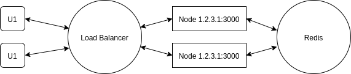

# adonis-redis-server

The idea was to create single **AWS Lightsails Instance** behind  **Load Balancing**, acting as a **Redis** server, to **Broadcast** data to all **socket.io** client, share **Caching Data** from Database to all accross **node** **Adonis** instances.

# Implementation

# Redis server installation on Instance

Login to aws console, lightsails, and  create an instance
connect using SSH

wrote down **Internal** and **Public IP Adress**

## 1. Instal redis-server

    cache policy redis-server
    apt-cache policy redis-server
    sudo apt update
    sudo apt install redis-server

## 2. Enable port to be open
Get detail on Lightsails instance, and add custom TCP port for **redis-server** accept incoming connection
eg: port 5001

## 3. Edit redis.conf
open and edit **redis-server** config file

    sudo nano /etc/redis/redis.conf

find and change port to **5001**, as mention above

    port 5001

find and change **bind** ip address to all network interfaces

    bind 0.0.0.0

save and exit
restart **redis-server**

    sudo systemctl restart redis-server

## 4. Test using redis-cli
test **ping** command, it should return PONG

    redis-cli -h localhost -p 5001 ping
    PONG
    
test **ping** command from **local docker**, it should return **PONG**

remember to change bracket **[external IP]** to your **External / Public IP** instance

    docker run -d -p 6379:6379 --name redis-serv redis
    docker exec -it redis-serv sh
    redis-cli -h [external IP] -p 5001 ping
    PONG
stoping docker

    docker stop redis-serv
    
    
## 5. Verify redis-server is listening on all interfaces on port 5001:

    ss -an | grep 5001
    
## 6. Secure redis-server with password
open **redis-server** conf file

    sudo nano /etc/redis/redis.conf
    
Scroll to the SECURITY section and look for a commented directive that reads:

    # requirepass foobared
    
Uncomment it by removing the **#**, and change **foobared** to a secure password.

Save and exit editor

restart **redis-server** to implement password

    sudo systemctl restart redis.service
    
Testing **redis-cli** ping command, with password

    redis-cli -h localhost -p 5001 -a [your_password] ping
    PONG
    
    
    
# Using Adonis JS - Redis (Adonis JS ver 3.2 Legacy)

Make sure you have install **Adonis Redis** and have it running. https://adonisjs.com/docs/3.2/redis

## 1. Edit your redis.js configuration

Open **redis.js** inside your **/config/** folder

    local: {
        host:  'YOUR EXTERNAL PUBLIC IP',
        port: 5001,
        password: 'YOUR REDIS PASSWORD',
        db: 0,
        family: 4,
        keyPrefix: ''
    },

remember to change redis IP to internal, after you deploy your app to aws instance

## 2. Edit your redis.js bootstrap file
Open **redis.js** inside your **/bootstrap/** folder

add line below, and run your adonis

    'use strict'

    const Redis = use('Redis')
    // console.log(Redis)
    Redis.on('connect', function () {
        console.log('Redis connect')
      // ...
    })

    Redis.on('ready', function () {
      console.log('Redis ready')
    // ...
    })

    Redis.on('close', function () {
      console.log('Redis close')
    // ...
    })

    Redis.on('error', function (error) {
        console.log('Redis error', error)
      // ...
    })
    
now if you start **npm run dev** command, you should see your **Redis** state information

    [nodemon] starting `node start.js`
    info adonis:framework +1ms serving app on localhost:3333    
    Event.any: Http.start
    Redis connect
    Redis ready
    
## 3. Remember to stringify your json data via Redis

**Stringify** and **parse** your json data, if you want to push it via **Redis**
Stringify on **publish**

    const Redis = use('Redis')
	Redis.publish('some.name.for.publish', JSON.stringify(json_data))
    
JSON.parse on Redis **subscribe**

    Redis.subscribe('some.name.for.publish', function * (data_string) {
      var parse_obj = JSON.parse(data_string)
      //Broadcast Socket
    })

# Docker Redis server test

# Docker Redis server test

## 1. Start a new container running Redis

Give the container name **redis-serv** and exposing port **6379**

    docker run -d -p 6379:6379 --name redis-serv redis
To check it running, with

    docker ps
To view log output, with

    docker logs redis-serv

## 2. Running the Redis CLI in the container
use **-it** to run **redis-cli** via shell **sh**

    docker exec -it redis-serv sh
now we can start run **redis-cli**

    # redis-cli
    127.0.0.1:6379>

## 3. Basic Redis command
run Ping command

    127.0.0.1:6379> ping
    PONG
try to save same key value

    127.0.0.1:6379> set firstname John
    OK
    127.0.0.1:6379> set lastname Doe
    OK
and now exit out

    127.0.0.1:6379> exit
    # exit

 ## 4. Create another container, as client and linked to redis-serv
 New container name is **client-1**, copied from **redis** image, but this client will not running **Redis** itself . So we ask it to run shell **sh** in **-it** mode
 **--rm** will delete itself after the shell exits.

    docker run -it --rm --link redis-serv:redis --name client-1 redis sh
    
as **client**, connect it to **redis sever** via **redis-cli**

    # redis-cli -h redis
    redis:6379>

Now we tried to call last two keys that we save earlier 

    redis:6379> get firstname
    "John"
    redis:6379> get lastname
    "Doe"
    redis:6379>

on exiting will be destroy **client-1** container

    redis:6379> exit
    # exit

## Clean Up
list all runnning container

    docker ps
stop and remove **redis-serv**

    docker stop redis-serv
    docker rm redis-serv
